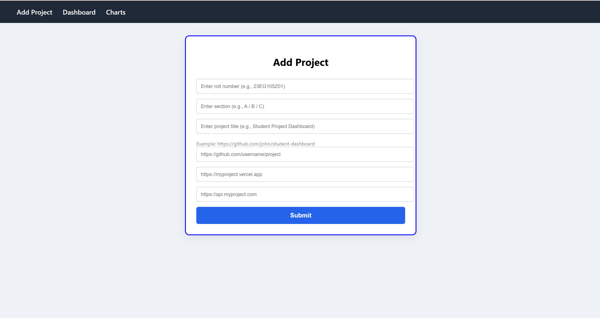
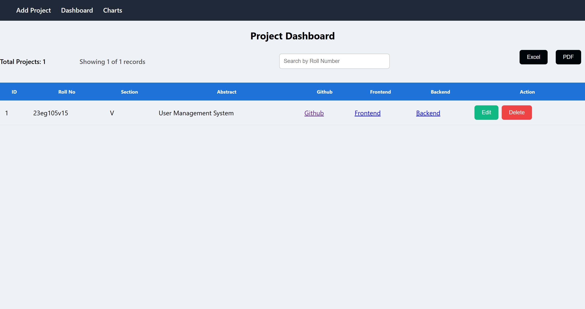
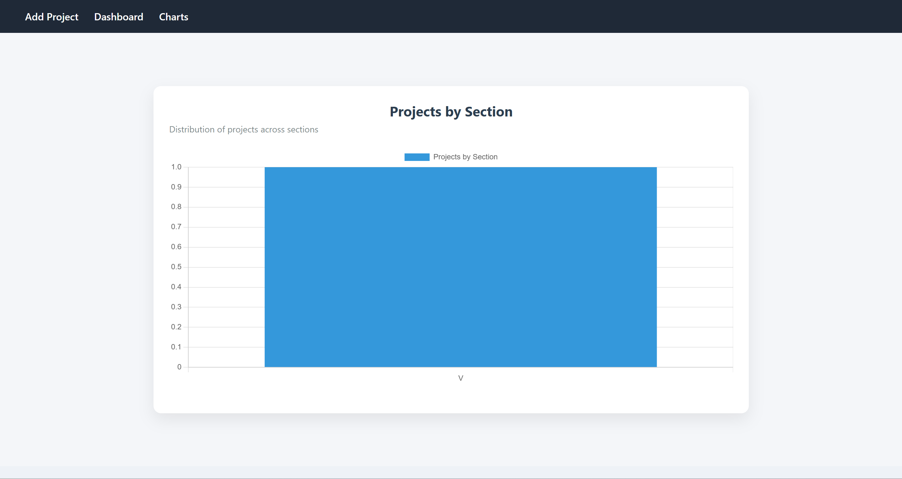

# 📌 Project Form – Submission & Dashboard System


A full‑stack web application built using **React, Spring Boot, and PostgreSQL (Neon Cloud)** that allows users to submit project details and manage them through a dashboard.

This project demonstrates **REST API design, full‑stack integration, responsive UI, and cloud database usage**.

---

# 🎥 Live Demo
Frontend (Vercel)
```
https://ttautt.vercel.app
```
Backend API (Render)

```
https://project-form-2yll.onrender.com
```
---

# 🚀 Project Overview

The system collects and manages student project submissions including:

- Roll number  
- Section  
- Project title  
- GitHub repository link  
- Frontend deployment link  
- Backend API link  

Submitted projects can be **viewed, edited, deleted, exported, and analyzed** using the dashboard.

---

# ✨ Features

## 📄 Project Submission
- Add project details through a form
- Automatic uppercase formatting for roll numbers
- Required field validation
- URL validation for links
- Duplicate roll number prevention

## 📊 Dashboard Management
- View all submitted projects
- Search projects by roll number
- Edit project details
- Delete projects

## 📤 Data Export
- Export project data to **Excel (.xlsx)**
- Export project data to **PDF**

## 📈 Analytics
- Chart visualization showing **Projects by Section**

## 🎨 UI / UX
- Toast notifications
- Loader animation while fetching data
- Responsive mobile design
- Mobile card layout for project records

---

# 🏗 System Architecture

React Frontend  
⬇ Axios HTTP Requests  
Spring Boot REST API  
⬇ Spring Data JPA  
PostgreSQL Database (Neon Cloud)

Backend layers:

Controller → REST endpoints  
Repository → database operations  
Entity → database models  

---

# 🛠 Tech Stack

## Frontend
- React (Vite)
- Axios
- React Router
- Chart.js
- React Hot Toast
- CSS

## Backend
- Spring Boot
- Spring Data JPA
- Hibernate
- Maven
- REST APIs

## Database
- PostgreSQL (Neon Cloud)

---


# ▶ Running the Project / ⚡ Installation

#### 1️⃣ Clone the repository
```
git clone https://github.com/yourusername/project-form.git
```
---
#### 🗄 Database Setup

Create a Neon PostgreSQL database.

 Add `.env` configuration in Backend : 
```
spring.datasource.url=${YOUR_DATABASE_URL}  
spring.datasource.username=${YOUR_DATABASE_USERNAME}  
spring.datasource.password=${YOUR_DATABASE_PASSWORD}  

```
---

#### 2️⃣ Run Backend
cd server
mvn spring-boot:run

Backend runs on:

http://localhost:4040

Update src/api/Api.js → set base_url to your backend URL.

#### 3️⃣ Run Frontend


cd client
npm install
npm run dev

Frontend runs on:

http://localhost:5173

---

# 🔗 API Endpoints

| Method |     Endpoint      |    Description   |
|--------|-------------------|------------------|
|GET     | /data/all         | Get all projects |
|POST    | /data/add         | Add project      |
|PUT     | /data/update/{id} | Update project   |
|DELETE  | /data/delete/{id} | Delete project   |


## 🔍 Example API Request
Add Project

POST /data/add

Request Body:
```
{
  "rollno": "21CS001",
  "section": "A",
  "abstractname": "Project Dashboard",
  "github": "https://github.com/user/project",
  "frontend": "https://project.vercel.app",
  "backend": "https://api.project.com"
}
```
Response:

"Data inserted successfully"
---
# 📸 Screenshots


Example usage in README:

  
  


---

# 🌐 Deployment

Typical deployment setup:

Frontend → Vercel  
Backend → Render  
Database → Neon PostgreSQL

Example:

Frontend: https://ttautt.vercel.app/


Backend: https://project-form-2yll.onrender.com

---


---


